# Building a Production-Grade Cloud Data Warehouse: AWS S3 + Snowflake

Ever wondered how companies handle millions of transactions and turn them into business intelligence? I just completed a portfolio project that walks through the entire journey—from raw CSV files to advanced analytics in the cloud.

## The Challenge

E-commerce companies generate massive amounts of transactional data daily. But raw data sitting in files doesn't drive business decisions. The challenge was building a complete cloud data warehousing solution that:

- Securely ingests data from cloud storage into a scalable warehouse
- Implements enterprise patterns for data quality and governance
- Enables sophisticated analytics for business intelligence
- Optimizes for both cost and performance

This project demonstrates end-to-end data engineering using modern cloud platforms, tackling real challenges you'd face building production data warehouses.

## The Dataset

To make this project realistic, I worked with a **public e-commerce dataset from Kaggle: UCI Online Retail II**.

- **Source**: https://www.kaggle.com/datasets/mashlyn/online-retail-ii-uci
- **Description**: Actual transactions from a UK-based online retail company
- **Fields**: InvoiceNo, StockCode, Description, Quantity, InvoiceDate, Price, Customer ID, Country
- **Scale**: 1M+ rows covering 2009-2011 transactions

This real-world dataset came with all the messiness you'd expect: missing customer IDs, cancelled orders, negative quantities, and data quality issues. Perfect for demonstrating production-grade data engineering practices.

## The Implementation Journey

### Phase 1: Building the Foundation

#### Setting Up for Success

Starting a cloud data warehouse project requires more than just writing code—it demands careful planning and organization from day one.

I built a multi-layer data warehouse using AWS S3 and Snowflake. Before diving into the data pipeline, I established a solid foundation focusing on three critical aspects: security, organization, and maintainability.

The directory structure mirrors the medallion architecture I'd be implementing in Snowflake—raw, staging, and production layers. This alignment between the codebase and the data warehouse makes it intuitive to navigate and maintain.

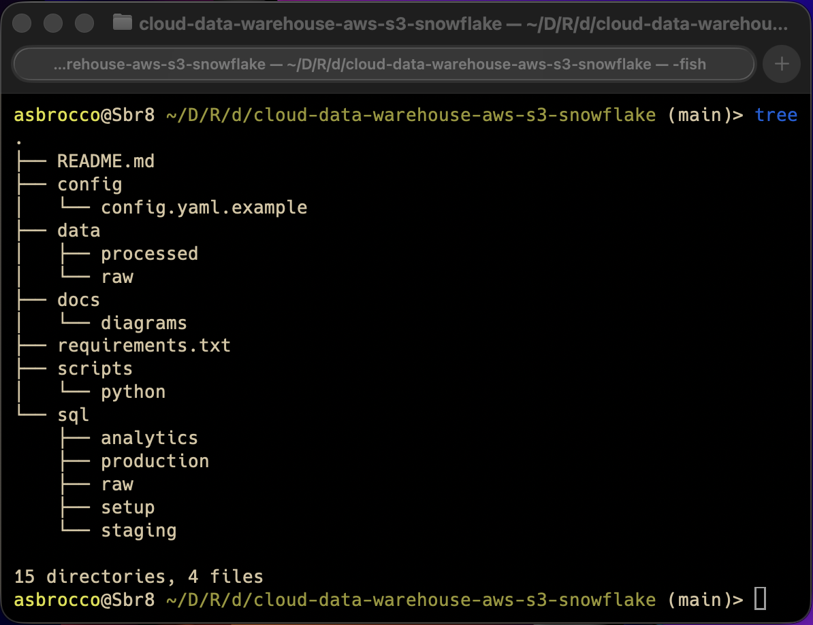
*Clean project structure following data engineering best practices*

Security was paramount. I implemented comprehensive `.gitignore` rules to prevent credential leaks and created template files (`.env.example`, `config.yaml.example`) that guide setup without exposing secrets. This approach is crucial in data engineering where we regularly work with sensitive credentials across multiple cloud platforms.

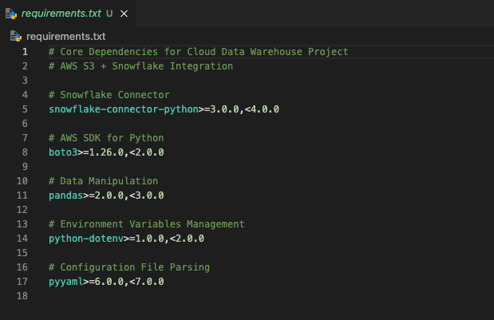

The Python environment uses version-constrained dependencies for tools like `snowflake-connector-python`, `boto3`, and `pandas`—balancing compatibility with stability.

#### AWS S3: The Secure Landing Zone

When building a cloud data warehouse, one of the first critical decisions is where your raw data will land. I configured AWS S3 as the secure landing zone for e-commerce data before ingestion into Snowflake.

The setup involved creating an S3 bucket with production-ready configurations:

**Security First**: I enabled all four "Block Public Access" settings to ensure the data remains private. This is crucial for data warehouse workloads where sensitive business data should never be publicly accessible.

**Data Protection**: Bucket versioning was enabled to protect against accidental overwrites and deletions. This creates a safety net and supports data lineage tracking—essential when you need to trace how data evolved over time.

**Encryption at Rest**: I configured default server-side encryption using SSE-S3 (Amazon S3 managed keys). Every object uploaded to this bucket is automatically encrypted at no additional cost.

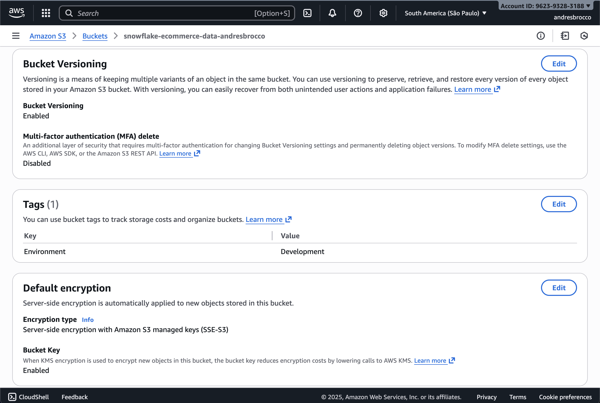
*Security best practices: versioning and encryption enabled*

#### Snowflake: Understanding Storage and Compute Separation

After setting up AWS S3 as the storage layer, the next piece was configuring Snowflake—the cloud data warehouse that hosts all analytics workloads.

One of Snowflake's most powerful features is its **separation of storage and compute**. Unlike traditional databases where you scale everything together, Snowflake lets you independently scale compute resources (virtual warehouses) based on workload needs, while storage scales automatically.

For this project, I configured a virtual warehouse with cost-efficiency in mind:

**X-Small Warehouse**: The smallest compute size, perfect for development. At $3.10 per credit in the São Paulo region, this translates to roughly $3.10/hour when actively running.

**Auto-Suspend (10 minutes)**: The warehouse automatically suspends after 10 minutes of inactivity. This means I only pay for compute when queries are actually running.

**Auto-Resume**: When I execute a new query, the warehouse automatically resumes in less than 3 seconds (according to the snowflake docs). No manual intervention needed.

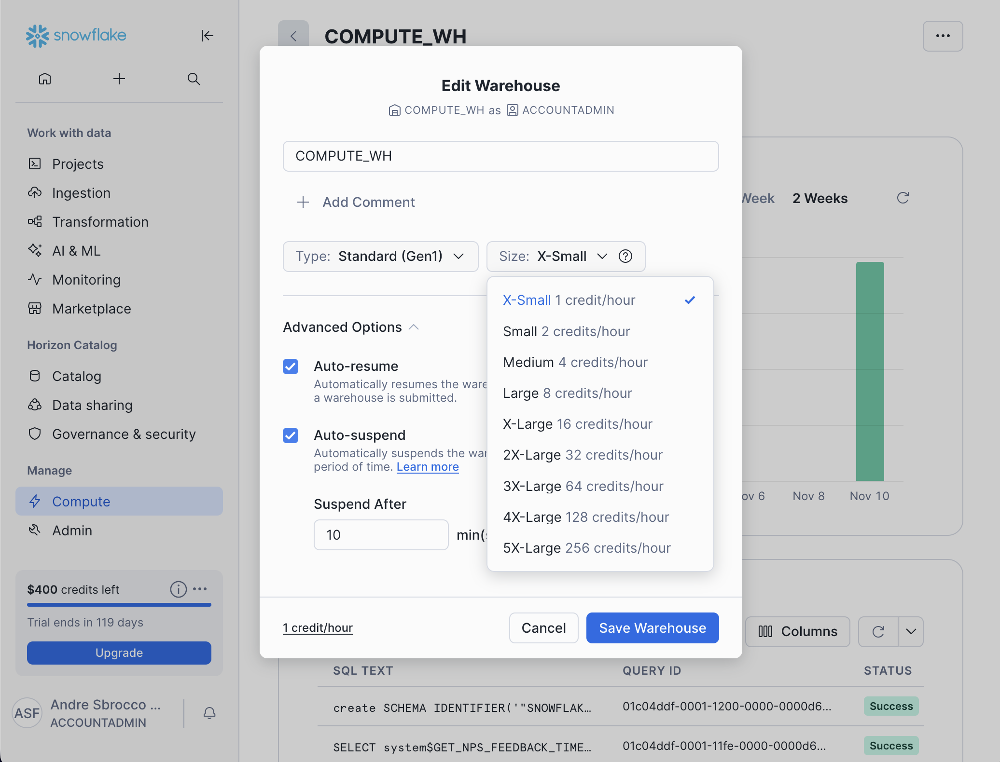
*Cost-optimized compute configuration for efficient data processing*

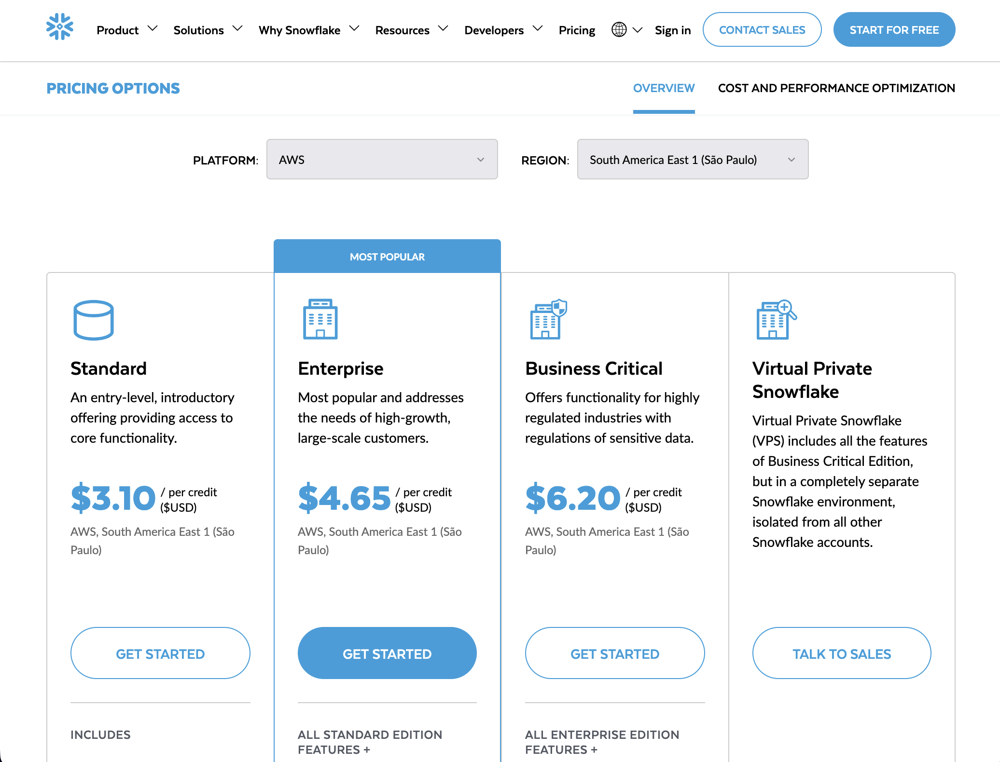
*Costs vary from region to region (aws-sa-east-1 being one of the most expensive ones)*

### Phase 2: Data Preparation and Integration

#### CSV vs Parquet: The Real-World Test

After setting up AWS S3 and Snowflake, I worked with the UCI Online Retail II dataset (1M+ transactions) and implemented a Python script to convert it from CSV to Parquet format.

The results were impressive: the Parquet file achieved 92.4% compression, reducing storage from 90.5 MB to just 6.9 MB.

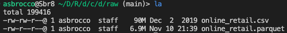
*File size comparison: parquet takes 92.4% less disk space than CSV*

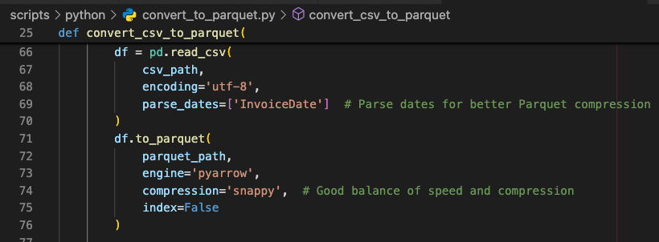
*Python code snippet showing CSV to Parquet conversion*

I uploaded both formats to S3, following an ELT (Extract, Load, Transform) approach. Instead of cleaning the data locally, I'm keeping it raw—the transformation logic will live in Snowflake where it belongs.

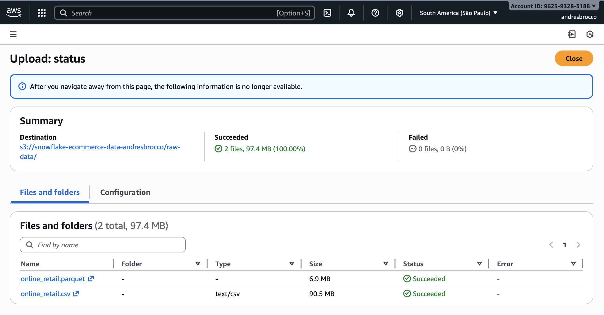
*Files uploaded to the S3 bucket*

#### Secure Cross-Account Access

Getting Snowflake to talk to my S3 bucket turned out to be more interesting than I expected. I could've just used AWS access keys, but that felt wrong - storing long-lived credentials isn't a good practice, even for a portfolio project.

Instead, I went with Snowflake's storage integration approach. The setup involves creating an IAM role in AWS that Snowflake can assume, using a trust relationship with an External ID for added security.

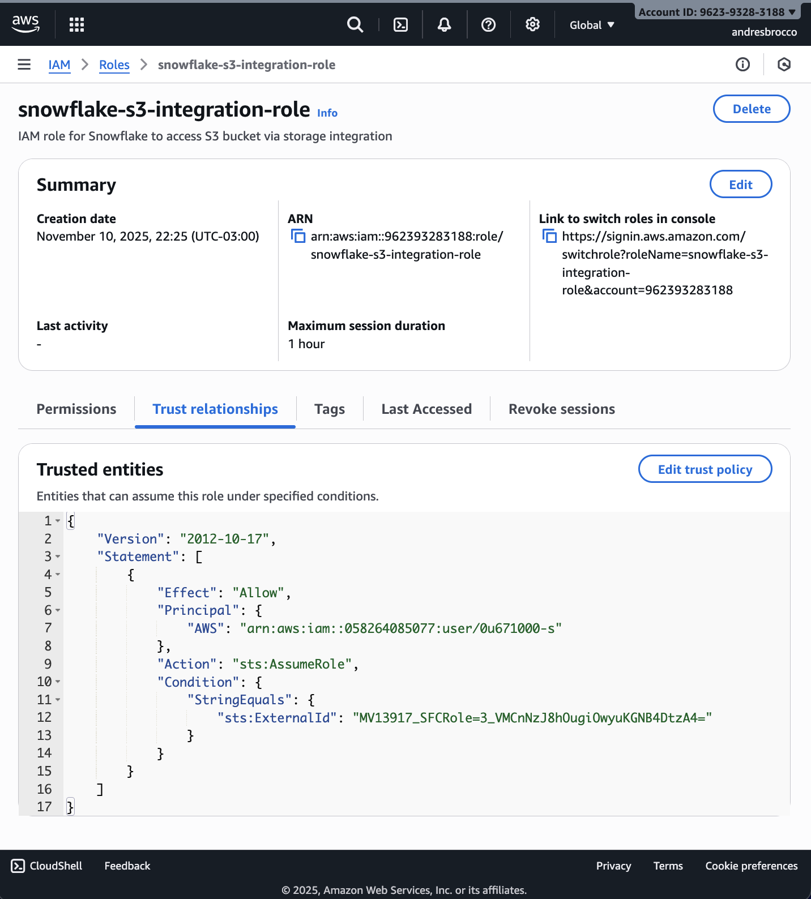
*IAM role with trust relationship*

The tricky part was understanding the two-way configuration: first creating the storage integration in Snowflake, then copying the IAM user ARN and External ID back to AWS to update the trust policy.

The result? No hardcoded credentials, and Snowflake can read from S3 using temporary tokens. Much cleaner than managing access keys.

### Phase 3: Multi-Layer Data Warehouse Architecture

#### Implementing the Medallion Pattern

One of the most important architectural decisions in any data warehouse project is how to organize your data layers. I implemented a three-layer medallion architecture in Snowflake that mirrors what you'd see in enterprise data platforms.

The architecture consists of three distinct schemas:

**RAW Layer** - Where data lands exactly as it comes from the source. The key principle here is immutability - once data is loaded, it's never modified. This preserves data lineage and gives you the ability to reprocess data without re-extracting from external sources.

**STAGING Layer** - Where the magic happens. Data gets cleaned, validated, and transformed according to business rules. Bad records are filtered out, data types are standardized, and business logic is applied.

**PRODUCTION Layer** - Contains the dimensional model (fact and dimension tables) optimized for analytics. The data here is denormalized and structured specifically for query performance.

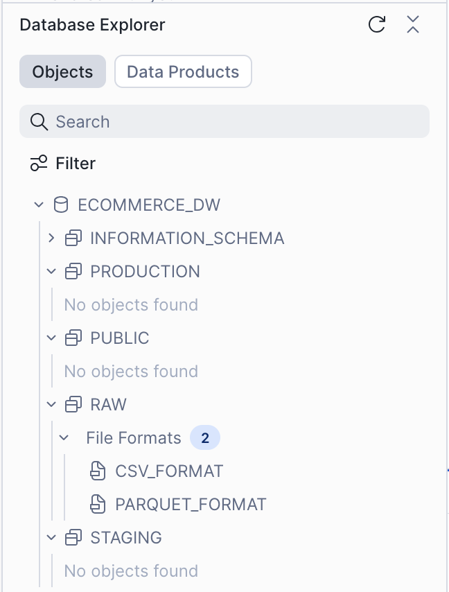
*Snowflake database browser with schemas and file formats*

Why this approach? Separation of concerns. Each layer has a single responsibility, making the pipeline easier to debug, maintain, and extend.

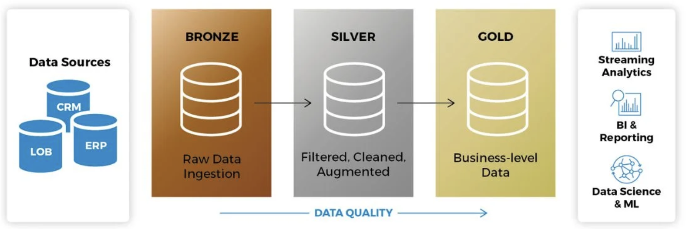
*Data flow through three layers (RAW → STAGING → PRODUCTION)*

#### Loading Data: CSV vs Parquet Performance

I built the actual data ingestion pipeline from S3 to Snowflake using external stages and COPY INTO. But I didn't just load the data—I wanted to test something everyone always says: "use Parquet instead of CSV."

So I loaded the same 1M+ row dataset in both formats and benchmarked everything.

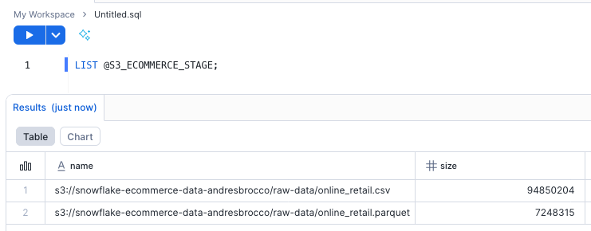
*Both CSV (95 MB) and Parquet (7 MB) versions of the dataset are accessible from Snowflake via the external stage*

The results surprised me. CSV loaded in 8.6 seconds, Parquet took 12 seconds. Wait, what? Parquet is supposed to be faster.

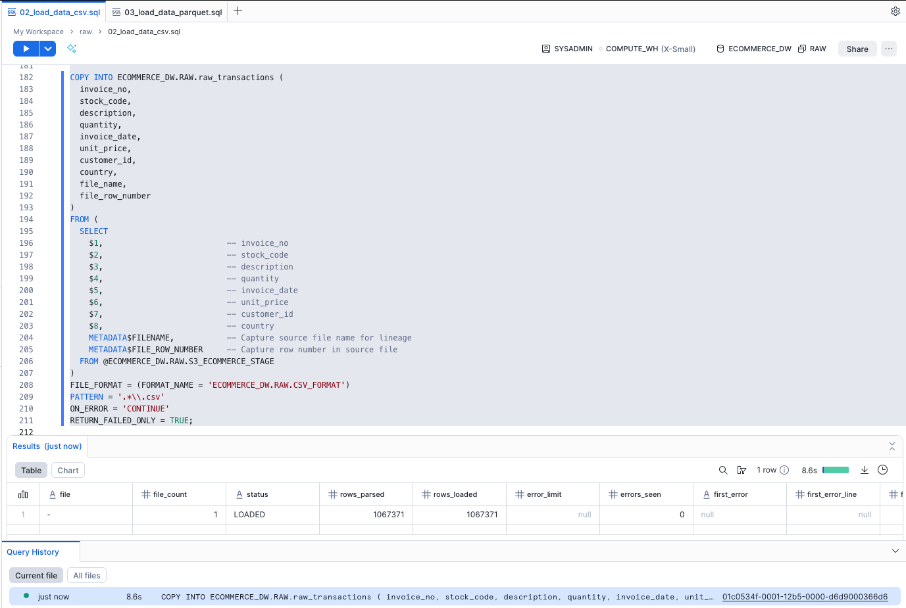
*CSV load completed in 8.6 seconds, loading over 1 million rows*

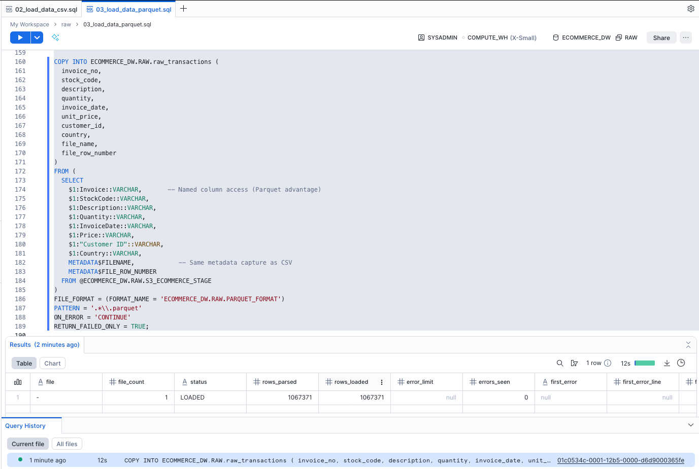
*Parquet load took 12 seconds - real-world results don't always match expectations*

Turns out, for small datasets (~100 MB), Parquet's columnar overhead can actually slow things down. The compression benefits don't outweigh the parsing complexity at this scale.

But here's the thing: Parquet still won where it matters. That 95 MB CSV file? Only 7 MB in Parquet (92% reduction). That's huge for S3 storage costs and data transfer fees.

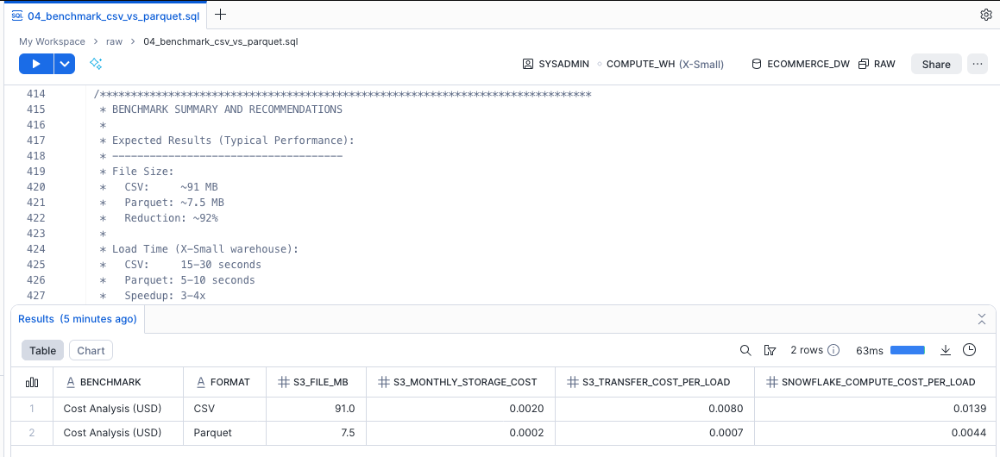
*Cost analysis showing significant savings with Parquet format in S3 storage and data transfer*

The bigger lesson? Don't just follow best practices blindly. Measure things. Real-world data beats assumptions every time.

#### Building a Production-Grade Data Quality Pipeline

One of the biggest lessons I learned while building this data warehouse: **raw data is never clean**. I implemented the STAGING layer - the quality gate between raw ingestion and production analytics.

The challenge? Real-world e-commerce data is messy. Cancelled orders, negative quantities, missing customer IDs, invalid dates - all lurking in the raw dataset. Instead of silently filtering these out, I implemented a "validate and flag" approach that marks problematic records while retaining them for quality monitoring.

Here's what made this transformation pipeline production-ready:

**Type Safety**: Used Snowflake's `TRY_CAST` functions to gracefully handle conversion failures from VARCHAR to proper types (INTEGER, DECIMAL, TIMESTAMP). Unlike `CAST`, which breaks the entire load on a single bad value, `TRY_CAST` returns NULL and lets the pipeline continue.

**Business Logic**: Computed `total_amount` at load time rather than in queries, created `invoice_date_key` in YYYYMMDD format for efficient date dimension joins, and excluded cancelled orders (invoice_no starting with 'C').

**Quality Tracking**: Every record gets an `is_valid` flag. Invalid records? They're flagged with specific reasons in `quality_issues` column - no silent data loss.

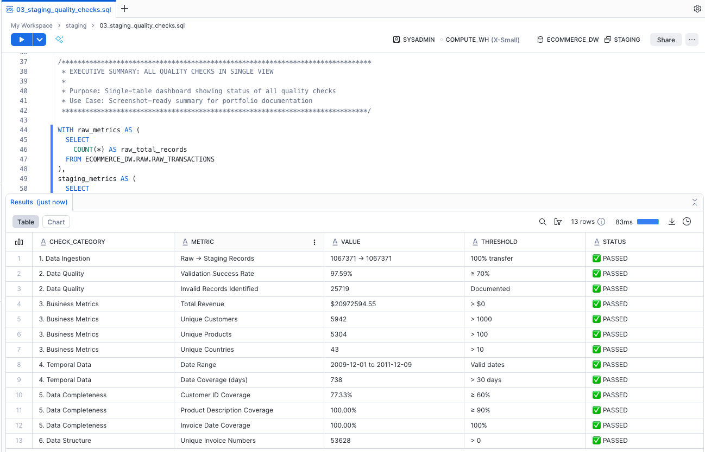
*Executive Summary of the staging quality checks*

The result: ~540,000 raw records transformed into ~400,000 validated, business-ready records (75-85% success rate - typical for real-world data).

### Phase 4: Dimensional Modeling (Snowflake Schema)

#### Designing the Dimension Tables

With clean data in staging, I moved on to the production layer—designing a snowflake schema for analytics. I built five dimension tables that normalize hierarchies instead of duplicating data everywhere.

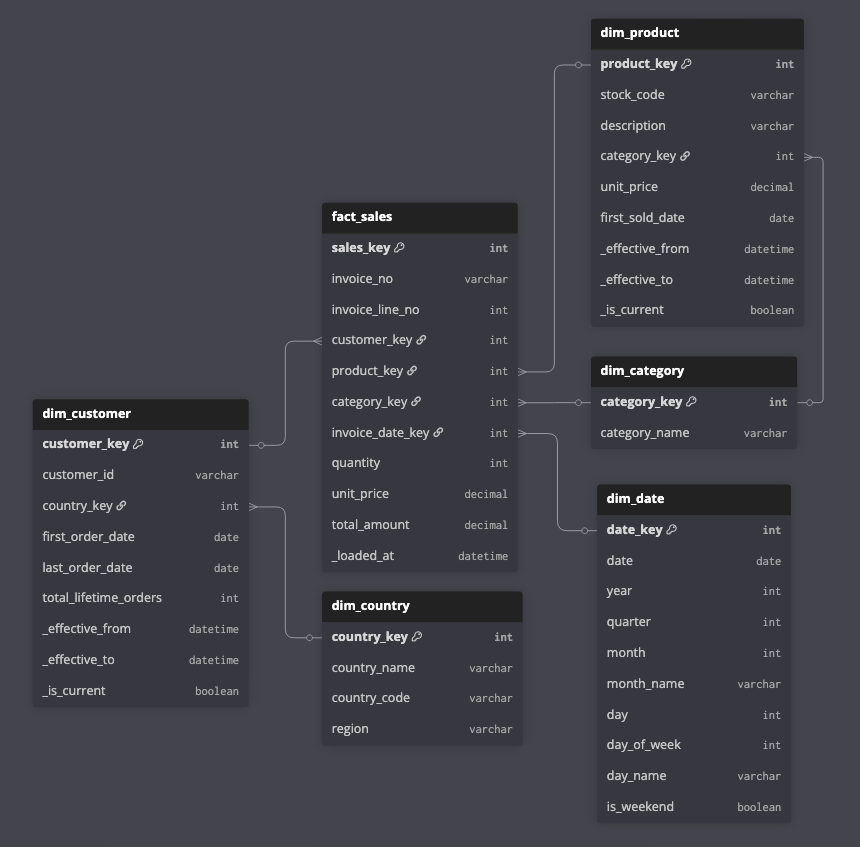
*The snowflake schema design with normalized dimensions*

The approach was straightforward: extract countries from customers, categories from products, and create a pre-built date dimension spanning 2009-2012. This way, instead of repeating "United Kingdom" thousands of times, I store it once and reference it with a key.

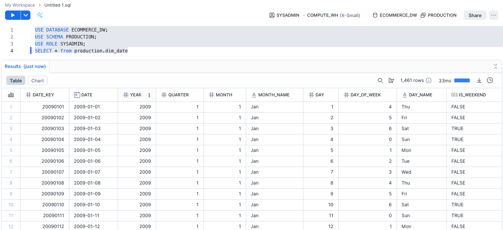
*Date dimension with pre-calculated attributes like quarter and weekend flags*

For customers and products, I implemented SCD Type 2 to track historical changes. Each row gets `_effective_from`, `_effective_to`, and `_is_current` columns, so I can see what a customer or product looked like at any point in time.

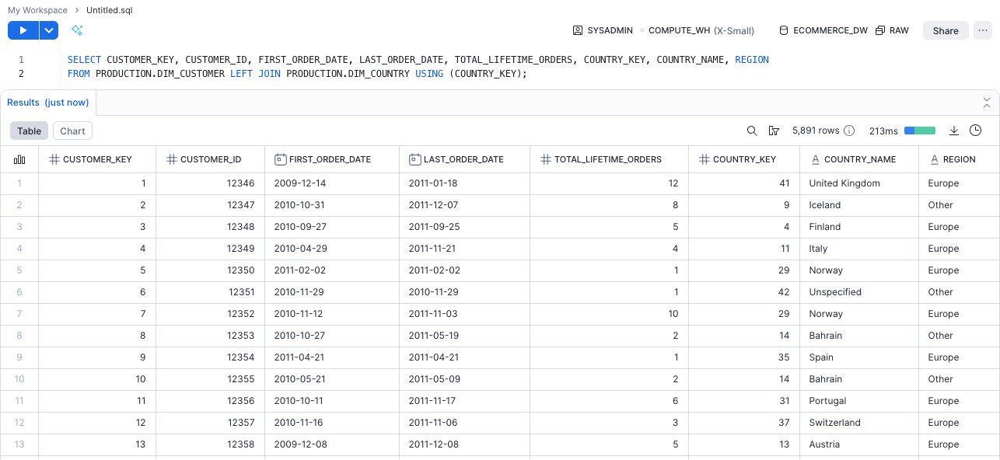
*Joining customers with the country dimension via foreign key*

The trade-off? More joins in queries. But Snowflake handles this well, and the benefits—less redundancy, cleaner updates, better integrity—made it worth it.

#### Building the Central Fact Table

After building all five dimension tables, I reached the most critical milestone: creating the fact table that ties everything together. The fact_sales table now sits at the center of a complete snowflake schema, ready to power analytics.

The fact table design started with defining the grain—arguably the most important decision in dimensional modeling. I chose "one row per invoice line item" to preserve maximum detail, enabling product-level analysis, basket analysis, and the flexibility to aggregate up to any business level.

*Dimensional modeling in action: fact table seamlessly joined with dimensions to show business-friendly analytics-ready data*

With the dimensional model complete, analytics queries become incredibly simple. Instead of complex joins across raw tables, I can now write straightforward SQL that joins the fact table to whichever dimensions I need.

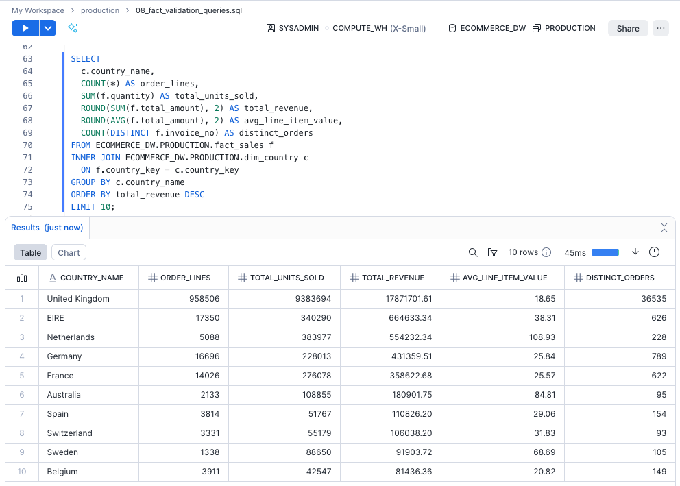
*Business analytics unlocked: revenue analysis by country showing United Kingdom as the top market*

### Phase 5: Advanced Analytics & Optimization

#### Customer and Product Intelligence

With the dimensional model in place, it was time to demonstrate what a well-designed data warehouse can really do. I built sophisticated SQL analytics queries that answer real business questions.

**Customer Intelligence:**
The Customer Lifetime Value (CLV) query identifies our most valuable customers—Customer #18102 leads with ~$609K in lifetime revenue across 145 orders. But raw revenue isn't enough. I implemented RFM (Recency, Frequency, Monetary) segmentation using NTILE() to classify customers into actionable groups: Champions, At Risk, Hibernating, and more.

*Customer #18102 leads with ~$609K in lifetime revenue across 145 orders*

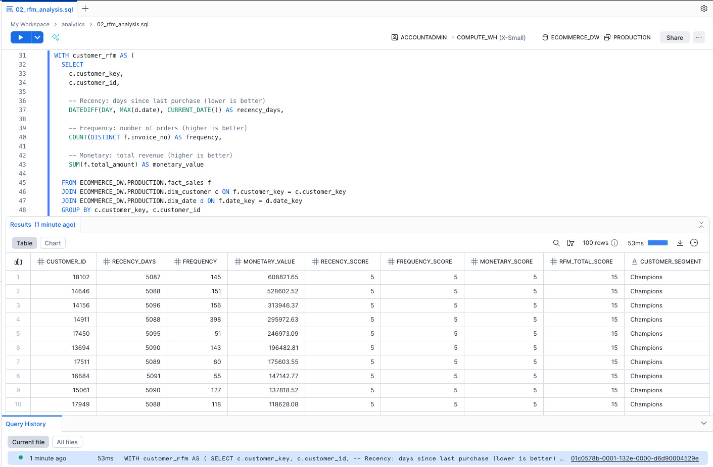
*All top 100 customers show RFM_TOTAL_SCORE of 15 (maximum possible)*

**Product Intelligence:**
Market basket analysis using self-joins revealed cross-selling opportunities—the "RED RETROSPOT JUMBO BAG" is frequently bought with "JUMBO BAG PINK WITH WHITE SPOTS". Product performance tracking with window functions calculates monthly rankings, running totals, and 3-month moving averages to identify products losing momentum or seasonal patterns.

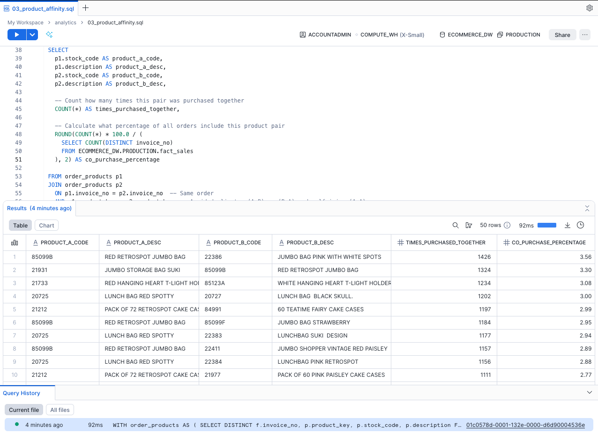
*The "RED RETROSPOT JUMBO BAG" is frequently bought with "JUMBO BAG PINK WITH WHITE SPOTS"*

*Monthly analysis of product performance: could be used to identify products losing momentum, or seasonality, etc.*

#### Time-Series and Cohort Analysis

I turned my attention to temporal analytics—understanding how customer behavior and revenue patterns evolve over time.

**Revenue Trend Analysis:** Using the LAG() window function, I built year-over-year and month-over-month growth calculations with 3-month moving averages to smooth out volatility. Comparing 2010 vs 2011 monthly patterns revealed clear growth trajectories.

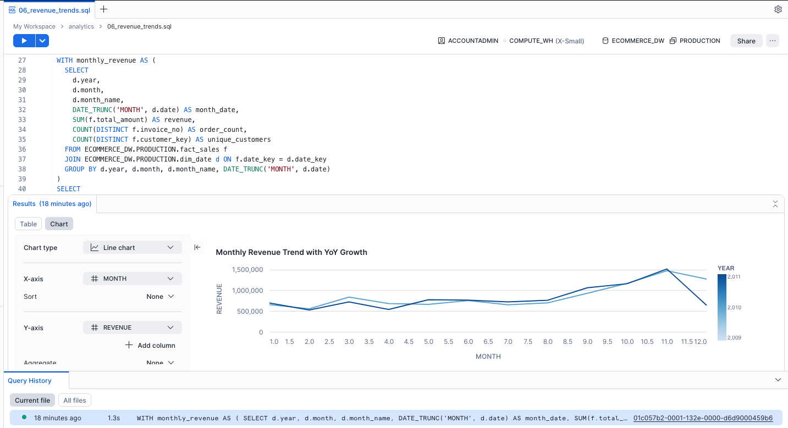
*Year-over-year revenue comparison: 2010 vs 2011 monthly trends*

**Cohort Retention Analysis:** I grouped customers by acquisition month and tracked their purchasing behavior over time. The pattern surprised me: steep retention drop after the first purchase, but customers who returned once showed remarkably stable engagement through month 6.

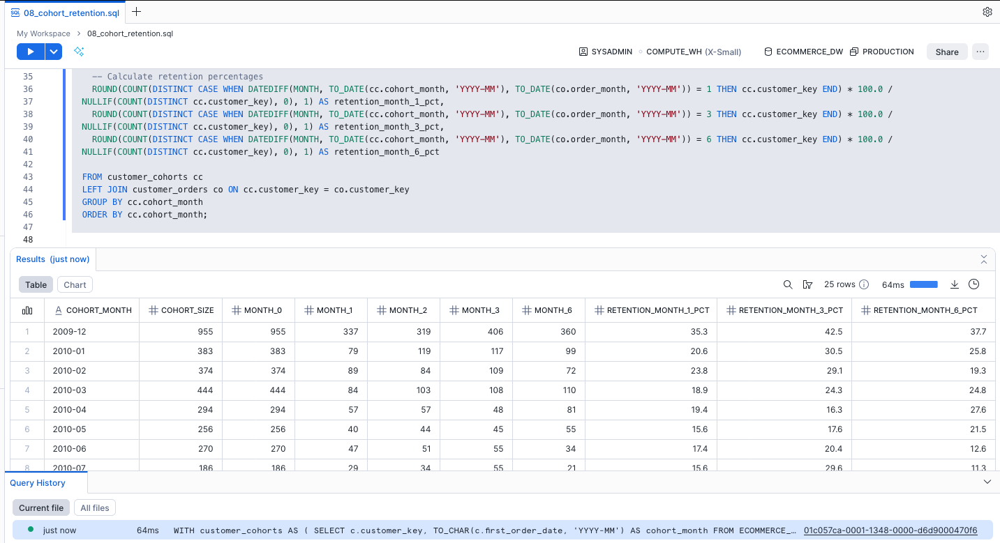
*Interesting retention pattern: steep drop after first purchase, but customers who return once show stable long-term engagement*

The SQL behind cohort analysis required multi-level CTEs with DATEDIFF() calculations—complex but powerful:

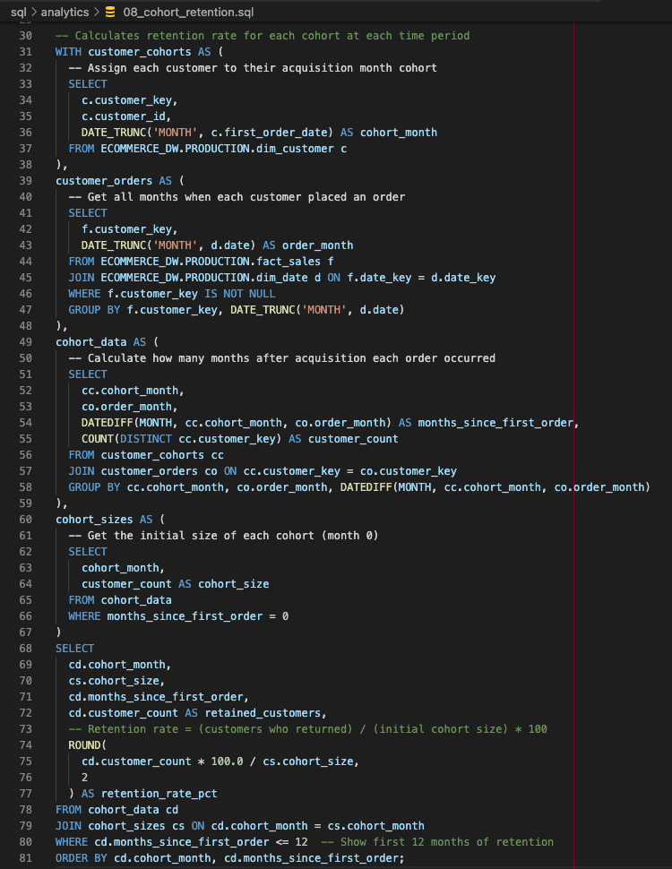
*The math behind retention: (retained_customers / cohort_size * 100)*

**Seasonality Detection:** Aggregating revenue by month revealed that November and December drive over 25% of annual revenue—critical for inventory planning.

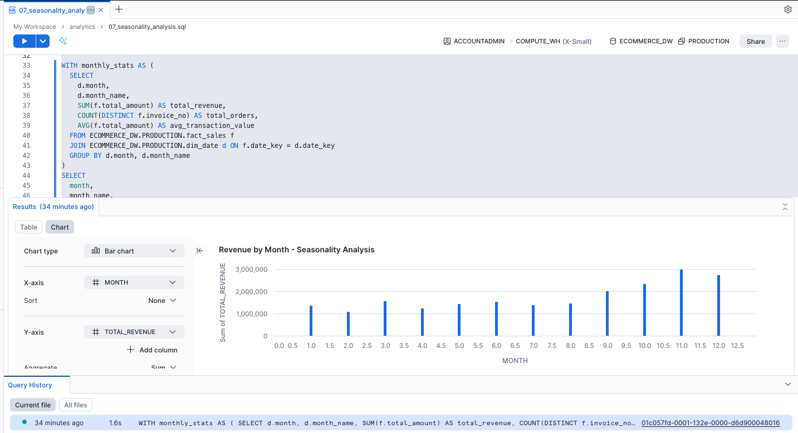
*Seasonality patterns emerge: November/December drive 25%+ of annual revenue*

#### Performance Optimization Strategy

One of the realities of learning cloud data warehousing is that not every feature is available on free trials. Snowflake's free trial doesn't include materialized views or search optimization services - two powerful performance features I wanted to implement.

But understanding **when** and **why** to use optimization features is just as valuable as implementing them.

I spent time designing a complete optimization strategy:

**Materialized Views:** I created three pre-aggregation views - customer summaries, product metrics, and daily sales rollups. These would cache expensive JOIN and GROUP BY operations, potentially cutting dashboard query times by 50-90%.

**Clustering Keys:** I designed clustering on the fact table using `(date_key, country_key)` - the most common filter columns. This physical data organization would help Snowflake skip irrelevant micro-partitions, reducing data scanned by 50-95% on date-range queries.

**Search Optimization:** I planned point lookup optimization for `customer_id` and `stock_code` - high-cardinality columns used in equality searches.

The lesson? Production data warehousing is about understanding trade-offs: query performance vs. storage costs, maintenance overhead vs. user experience, immediate needs vs. scalability.

## Key Takeaways

Through this project, I gained hands-on experience with:

**Cloud Architecture Patterns**
- Multi-layer data warehouse design (raw/staging/production)
- Secure cross-account integration between AWS and Snowflake
- Cost optimization through compute auto-suspend and right-sized warehouses

**Data Modeling & Quality**
- Dimensional modeling with snowflake schema (normalized dimensions)
- SCD Type 2 for tracking historical changes
- Production-grade data validation with quality tracking
- ETL vs ELT trade-offs and when to apply each

**Advanced SQL Techniques**
- Window functions (RANK, NTILE, LAG, moving averages)
- Common Table Expressions (CTEs) for complex multi-step analysis
- Self-joins for market basket analysis
- Statistical functions for customer segmentation

**Real-World Learning**
- Don't blindly follow "best practices" - measure and validate
- Security patterns matter even in portfolio projects
- Understanding trade-offs is as valuable as implementation
- Clean architecture makes complex projects maintainable

## Results & Metrics

**Project Scope:**
- 1M+ rows of e-commerce transactional data processed
- 3-layer architecture (raw/staging/production) implemented
- 6 dimension tables + 1 fact table (snowflake schema)
- 13 advanced SQL analytics modules built
- 92.4% storage reduction through Parquet format

**Implementation Time:**
- 13 steps completed across 8 days
- ~32 hours total development time
- Multiple cloud services integrated securely

**Technical Deliverables:**
- 40+ SQL scripts (DDL, DML, analytics)
- Python data processing utilities
- Comprehensive security configuration
- Performance optimization strategy
- Complete documentation

## What's Next

This project demonstrated the foundations of cloud data warehousing, but there's always room to grow:

**Automation**: Add orchestration with Apache Airflow or dbt for scheduled refreshes
**Visualization**: Connect Tableau/Power BI for interactive dashboards
**Advanced Analytics**: Implement machine learning models for customer churn prediction
**Real-Time**: Explore Snowflake Streams and Tasks for near-real-time analytics
**Cost Governance**: Implement resource monitors and query optimization techniques

## Technologies Used

**Cloud Platforms:**
- AWS S3 (object storage)
- AWS IAM (security & access management)
- Snowflake (cloud data warehouse)

**Languages & Tools:**
- SQL (DDL, DML, advanced analytics)
- Python (data processing, AWS boto3)
- Git (version control)

**Data Engineering Concepts:**
- Medallion architecture (Bronze/Silver/Gold layers)
- Dimensional modeling (snowflake schema)
- ETL/ELT patterns
- Data quality frameworks
- Performance optimization

---

**Interested in diving deeper?** The full project with all SQL scripts, Python code, and documentation is available on my GitHub. I'd love to hear your thoughts on cloud data warehousing patterns or discuss approaches you've used in your own projects!

Feel free to connect if you're passionate about data engineering, cloud architecture, or building scalable analytics solutions.

#DataEngineering #Snowflake #AWS #CloudComputing #DataWarehouse #SQL #Python #BigData #Analytics #CloudArchitecture #DataModeling #ETL #BusinessIntelligence #DataScience #TechPortfolio
